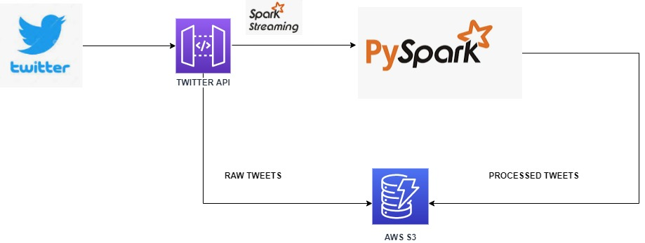

# Analysis on Crytocurrencies using Twitter data and NLP techniques

A cryptocurrency (or “crypto”) is a digital currency that can be used to buy goods and services, but uses an online ledger with strong cryptography to secure online transactions. Much of the interest in these unregulated currencies is to trade for profit, with speculators at times driving prices skyward.

Streaming twitter data is collected using Twitter API and twython. Analysis is performed using Pyspark

    Description of data: 
    "tweet_id",       
    "username",       
    "user_id",        
    "user_desc",      
    "created_at_str", 
    "date",           
    "text",           
    "hashtags",       
    "lang",           
    "profilepic",     
    "location",       
    "retweet_count",  
    "favorite_count", 
    "joined_in",      
    "is_Verfied",     
    "followers_count",
    "geo",            
    "source"          

    
It is saved in a AWS S3 for analysis

### ARCH
  
